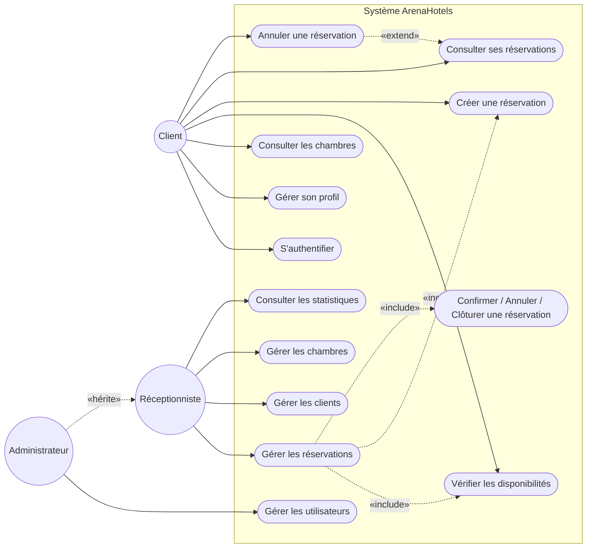
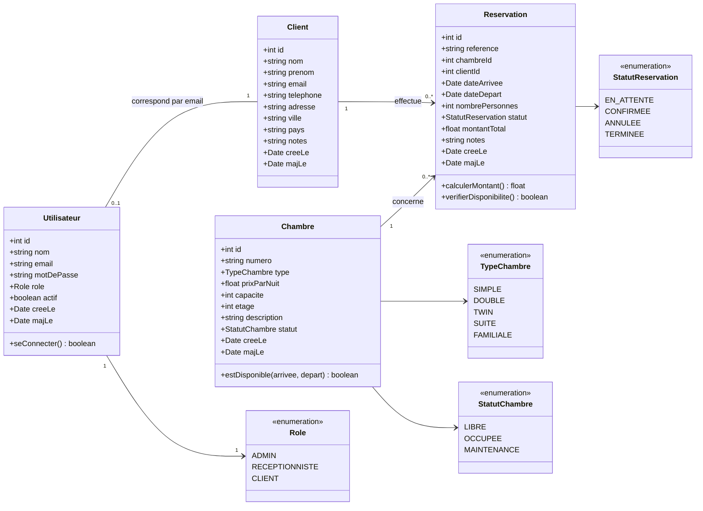
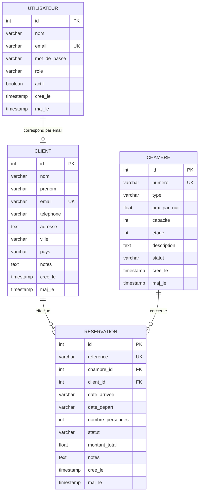

# Arena Hotels — Conception

> Diagrammes de **cas d'utilisation**, de **classes** et **MLDR** (Modèle Logique de Données Relationnel),
> conformes au schéma UML de référence du projet.
> Les diagrammes sont écrits en [Mermaid](https://mermaid.js.org) : ils s'affichent nativement sur GitHub,
> GitLab, VS Code (extension Markdown Preview Mermaid) et Notion.

---

## 1. Diagramme de cas d'utilisation

Trois acteurs : **Client**, **Réceptionniste**, **Administrateur**.
L'administrateur hérite des cas du réceptionniste ; la gestion des réservations *inclut* la vérification
des disponibilités, la création et la confirmation / annulation / clôture ; l'annulation *étend* la
consultation des réservations.

### Matrice de droits (rôle → cas d'utilisation)

| Fonctionnalité | Client | Réceptionniste | Admin |
|---|:---:|:---:|:---:|
| S'authentifier / profil | ✅ | ✅ | ✅ |
| Consulter les chambres | ✅ | ✅ | ✅ |
| Vérifier les disponibilités | ✅ | ✅ | ✅ |
| Créer une réservation | ✅ | ✅ | ✅ |
| Consulter ses réservations | les siennes | toutes | toutes |
| Annuler une réservation | les siennes | ✅ | ✅ |
| Gérer les réservations (confirmer / clôturer / check-in-out) | ❌ | ✅ | ✅ |
| Gérer les clients | son profil | ✅ | ✅ |
| Gérer les chambres | ❌ | ⚠️ (maj only) | ✅ |
| Consulter les statistiques | ❌ | ⚠️ | ✅ |
| Gérer les utilisateurs | ❌ | ❌ | ✅ |

---

## 2. Diagramme de classes

**Règles de gestion principales**
- Une `Reservation` relie exactement **un `Client`** et **une `Chambre`**.
- **Unicité de la période** : deux réservations bloquantes (`EN_ATTENTE`, `CONFIRMEE`) ne peuvent pas se
  chevaucher pour une même chambre (pas de sur-réservation).
- `dateDepart > dateArrivee` ; `nombrePersonnes ≤ chambre.capacite`.
- `montantTotal = nombreDeNuits × chambre.prixParNuit`.
- **Transitions de statut** autorisées : `EN_ATTENTE → {CONFIRMEE, ANNULEE}`, `CONFIRMEE → {TERMINEE, ANNULEE}`,
  `ANNULEE → {EN_ATTENTE}`, `TERMINEE → {}`.
- Un **CLIENT** n'agit que sur **ses propres** réservations ; il peut **annuler** mais pas confirmer ni
  faire le check-in/out.

---

## 3. MLDR — Modèle Logique de Données Relationnel

### 3.1 Schéma relationnel

### 3.2 Notation textuelle

Légende : **souligné** = clé primaire (PK) · `#` = clé étrangère (FK) · `U` = unique.

- **UTILISATEUR** (<u>id</u>, nom, email `U`, mot_de_passe, role, actif, cree_le, maj_le)
- **CLIENT** (<u>id</u>, nom, prenom, email `U`, telephone, adresse, ville, pays, notes, cree_le, maj_le)
- **CHAMBRE** (<u>id</u>, numero `U`, type, prix_par_nuit, capacite, etage, description, statut, cree_le, maj_le)
- **RESERVATION** (<u>id</u>, reference `U`, #chambre_id, #client_id, date_arrivee, date_depart,
  nombre_personnes, statut, montant_total, notes, cree_le, maj_le)
  - #chambre_id → CHAMBRE(id) · #client_id → CLIENT(id)

### 3.3 Contraintes principales

- email unique dans **UTILISATEUR** et **CLIENT**.
- numero unique dans **CHAMBRE**.
- reference unique dans **RESERVATION**.
- une réservation concerne exactement **un client** et **une chambre**.
- pas de chevauchement pour les réservations bloquantes.
- nombre de personnes ≤ capacité de la chambre.

### 3.4 Dictionnaire des données (extraits)

| Table | Colonne | Type | Contraintes | Description |
|---|---|---|---|---|
| UTILISATEUR | role | varchar(20) | ADMIN / RECEPTIONNISTE / CLIENT | Rôle d'autorisation |
| UTILISATEUR | email | varchar(160) | UNIQUE | Identifiant de connexion |
| CLIENT | email | varchar(160) | UNIQUE | Lien logique avec le compte |
| CHAMBRE | numero | varchar(20) | UNIQUE | Ex. « 101 » |
| CHAMBRE | type | varchar(20) | SIMPLE/DOUBLE/TWIN/SUITE/FAMILIALE | Catégorie |
| CHAMBRE | statut | varchar(20) | LIBRE/OCCUPEE/MAINTENANCE | État courant |
| RESERVATION | date_arrivee | varchar(10) | format `YYYY-MM-DD` | Nuit d'arrivée |
| RESERVATION | date_depart | varchar(10) | `> date_arrivee` | Nuit de départ |
| RESERVATION | statut | varchar(20) | EN_ATTENTE/CONFIRMEE/ANNULEE/TERMINEE | Cycle de vie |
| RESERVATION | montant_total | float | calculé | nuits × prix_par_nuit |

> **Cardinalités** : un `CLIENT` effectue `0..N` `RESERVATION` ; une `CHAMBRE` est concernée par `0..N`
> `RESERVATION`. Un `UTILISATEUR` (rôle CLIENT) correspond à `0..1` `CLIENT` (association logique par
> email — la fiche client est créée automatiquement à la première réservation).
